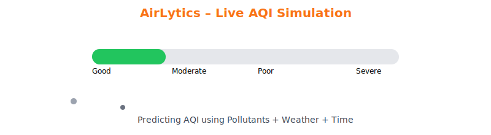

#  AirLytics – Smart Air Quality Prediction System
<p align="center">
  
</p>

##  Live AQI Mini Simulation



##  Automation Stats

- **AQI Pipeline Runs:** <!--RUN_COUNT-->0<!--/RUN_COUNT-->

##  Intelligent AQI Dashboard (Animated Mock)




### *Machine Learning–Driven Environmental Intelligence Platform*

AirLytics is an **end-to-end Machine Learning and Data Analytics platform** designed to **predict, analyze, and visualize Air Quality Index (AQI)** using historical air pollution, weather, and temporal data.

The system transforms raw environmental data into **actionable insights** through predictive modeling, explainable AI (XAI), and full-stack cloud deployment.

---
##  Project Overview

Air pollution poses a critical threat to public health and environmental sustainability.
**AirLytics** addresses this challenge by providing a **predictive, interpretable, and scalable AQI forecasting system** that supports:

* Environmental monitoring
* Public health preparedness
* Data-driven policy and decision-making

Unlike traditional reactive systems, AirLytics is **predictive-first**, explainable, and production-ready.

---

##  Live Project Architecture

| Layer              | Platform     |
| ------------------ | ------------ |
| ML Training        | Google Colab |
| Backend API        | Render       |
| Frontend Dashboard | Netlify      |

 Fully deployed, cloud-hosted, and production-ready

---

##  Key Features

* AQI Prediction (Regression)
*  AQI Category Classification (Good → Severe)
*  Pollutant + Weather + Temporal Modeling
*  Explainable AI using SHAP
* Advanced Environmental Visual Analytics
*  Cloud-Deployed Backend & Frontend
*  Scalable & Modular Architecture

---

##  Problem Statement

AQI variation depends on:

* Multiple interacting pollutants
* Seasonal and meteorological effects
* Non-linear feature relationships
* Time-dependent environmental patterns

### Limitations of Traditional Systems

* Reactive rather than predictive
* Poor interpretability
* Weak handling of extreme pollution events

###  Objective

To design a **machine learning–based AQI prediction system** that is:

* Predictive
* Interpretable
* Scalable
* Deployment-ready

---

## System Architecture

AirLytics follows a **three-tier client–server architecture**:

### 1️ Machine Learning Layer (Google Colab)

* Data cleaning & preprocessing
* Feature engineering
* Model training & evaluation
* Explainability using SHAP
* Model versioning

### 2️Backend Layer (Render)

* REST API (FastAPI / Flask)
* Model inference endpoints
* JSON-based communication

### 3️ Frontend Layer (Netlify)

* Interactive AQI dashboards
* Charts, gauges & streamgraphs
* User-friendly analytics interface

---

##  Technologies Used

###  Machine Learning & Data Science

* Python
* Pandas, NumPy
* Scikit-learn
* Random Forest Regressor & Classifier
* SHAP (Explainable AI)

###  Data Visualization

* Matplotlib
* Seaborn
* AQI Gauge Charts
* Streamgraphs
* Feature Relationship Network Graphs

###  Backend

* FastAPI / Flask
* REST APIs
* Render (Cloud Hosting)

###  Frontend

* HTML, CSS, JavaScript / React
* Interactive dashboards
* Netlify (Deployment)

---

##  Dataset Overview

* **Type:** State-wise AQI Dataset (India)
* **Size:** ~29,000+ records
* **Nature:** Historical daily environmental observations

### Feature Categories

** Pollutants**
PM2.5, PM10, NO, NO₂, NOx, SO₂, CO, O₃, Benzene, Toluene, Xylene

** Weather**
Temperature, Humidity, Wind Speed

** Temporal**
Year, Month, Season

** Categorical**
State

### Target Variables

* **AQI** → Regression
* **AQI_Bucket** → Classification

---

##  Data Preprocessing

* Missing value handling (KNN & statistical imputation)
* Date-time parsing & chronological sorting
* Feature scaling using StandardScaler
* One-hot encoding for categorical variables
* **Time-based train–test split** (prevents data leakage)

---

##  Machine Learning Models

###  Random Forest Regressor

* Predicts continuous AQI values
* Handles non-linear relationships
* Robust to noise
* Built-in feature importance

###  Random Forest Classifier

* Predicts AQI categories
* Handles class imbalance
* Stable generalization

  > XGBoost

Improved predictive accuracy

Better generalization

Optimized model size (~3MB)
### Why Random Forest?

* Excellent for tabular environmental data
* Lower overfitting risk
* Strong baseline with minimal tuning

---

##  Model Evaluation

### Regression Metrics

* MAE (Mean Absolute Error)
* RMSE (Root Mean Square Error)
* R² Score

### Classification Metrics

* Accuracy
* Precision
* Recall
* F1-Score
* Confusion Matrix

---

##  Feature Importance & Explainability

### Top AQI Contributors

* PM2.5
* CO
* PM10
* NO₂
* SO₂

### Explainable AI (SHAP)

* Global feature impact analysis
* Local explanation for individual predictions

Enhances **model transparency, trust, and interpretability**.

---

##  Extreme AQI Optimization

* Sample weighting for high AQI values
* Improves prediction accuracy during severe pollution events
* Reduces bias toward normal AQI ranges

---

##  Advanced Analytics

* State-wise AQI distribution charts
* AQI gauge visualizations
* Temporal streamgraphs
* Feature interaction network graphs

These analytics extend the system beyond prediction into **decision-support intelligence**.

---

##  Deployment Details

| Component   | Platform     |
| ----------- | ------------ |
| ML Training | Google Colab |
| Backend API | Render       |
| Frontend UI | Netlify      |

---

##  Future Enhancements

* Real-time AQI prediction
* IoT sensor integration
* GIS-based pollution mapping
* Deep learning models (LSTM, Transformers)
* Mobile alerts & notifications

---

##  Known Limitations

* Reduced accuracy during rare weather anomalies
* No real-time sensor data integration
* Limited spatial resolution at city level

---

##  Real-World Impact Scenarios

* Government air quality monitoring
* Hospital preparedness for pollution-driven health risks
* Smart city traffic & industrial regulation
* Environmental research & policy analysis

---

##  Project Structure

```text
AirLytics-Smart-AQI-Prediction/
│
├── notebooks/
│   └── AirLytics_AQI_Model.ipynb
│
├── backend/
│   ├── app.py
│   ├── requirements.txt
│   ├── models/
│   │   ├── aqi_regressor.joblib
│   │   └── aqi_classifier.joblib
│   └── utils/
│
├── frontend/
│   ├── public/
│   ├── src/
│   │   ├── components/
│   │   ├── charts/
│   │   └── App.jsx
│   └── package.json
│
├── data/
│   └── aqi_data.csv
│
├── reports/
│   ├── AirLytics_Project_Report.pdf
│   └── figures/
│
├── README.md
└── LICENSE
```

---

##  Contributors

**Haldia Institute of Technology**
*B.Tech – Information Technology (2025–2026)*
**Cluster:** 3  **Batch:** 8

| Name                | Role                                                                  |
| ------------------- | --------------------------------------------------------------------- |
| **Sayantan Mondal** | Machine Learning, System Architecture, Backend, Deployment            |
| **Soumya Byabarta** | Data Analysis, Visualization, Backend Support, Project Management     |
| **Shuvam Mondal**   | Frontend Development, UI Integration, Machine Learning, Data Analysis |

---

##  Project Links

*  **Live Website:** [https://airlytics-live.netlify.app/](https://airlytics-live.netlify.app/)
*  **Project Documentation:** Notion case study link (Good Evening Sir,
Sharing the details of our project, AirLytics.
   Website: https://airlytics-live.netlify.app/
   otion Docs: https://www.notion.so/Development-Project-Report-300d95488c2780f19e29dba528835e78?source=copy_link)

---

##  License


---
##  Contact Us

For queries, collaboration, or feedback, feel free to reach out:

[](mailto:mondalsayantan690@gmail.com)

[](mailto:byabartasoumya@gmail.com)

[](mailto:shuvammondal128@gmail.com)


## 🏁 Final Note

AirLytics is designed as a **production-ready environmental intelligence system**, not just a notebook-based ML experiment.

It demonstrates:

* Responsible ML practices
* Explainability-first modeling
* Cloud-native deployment
* Real-world applicability


###  Support & Contributions

If you find **AirLytics** useful or inspiring, consider supporting the project:

[](https://ko-fi.com/A0A71Q1IEY)

[](https://www.buymeacoffee.com/sayantanmop)
